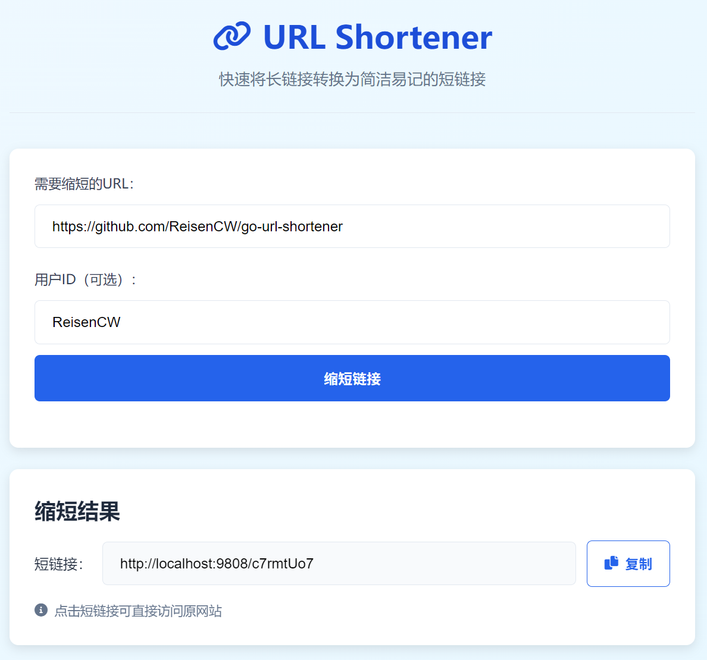
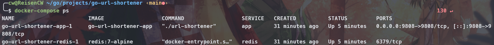

# 项目简介
* 本项目基于go语言,redis,以及一个简单的web前端,实现了一个url的shortener,用户可以将一个长url转换成一个短url,并且可以通过短url访问到长url.
* 本项目参考了教程https://www.eddywm.com/lets-build-a-url-shortener-in-go/ 并在其基础上进行了进一步的实现(包括web前端,docker部署以及一些功能的完善).

# 效果预览



# 如何运行
## 本地运行
前提：

- 已安装 Go（建议 Go 1.20+，项目使用 go 1.24）
- 已安装并可运行 Redis

本地快速运行步骤：

1. 克隆仓库（若尚未克隆）：
```shell
git clone https://github.com/ReisenCW/go-url-shortener.git
cd go-url-shortener
```

2. 启动 Redis：
	- 本地已安装 Redis：确保 redis-server 已启动并监听在 localhost:6379。

3. 获取并安装 Go 依赖（在项目根目录）：
```shell
go mod tidy
go mod download
```

4. 运行后端服务：
```shell
go run main.go
```
	服务器会默认在端口 9808 监听： http://localhost:9808

5. 打开前端页面：

	- 直接用浏览器打开  http://localhost:9808/web/ 访问前端界面

6. 测试：

	- 在前端页面输入长链接并点击 "缩短链接"。
	- 或在终端使用 curl 发 POST 请求（示例）：
```shell
curl -X POST http://localhost:9808/create-short-url \
	-H "Content-Type: application/json" \
	-d '{"long_url":"https://example.com/very/long/path","user_id":"tester"}'
```
	- 返回示例：
```
{
	"message": "short url created successfully",
	"short_url": "http://localhost:9808/abc12345"
}
```

## docker 运行
- 前提: 已安装 Docker 和 Docker Compose(如果是WSL环境, 可使用Docker Desktop)

```shell
# 启动服务(如果是第一次运行,会自动构建镜像)
docker-compose up -d 
```

- 输入以下命令, 会显示运行中的容器, 如果运行结果如下图所示, 说明docker部署成功
```shell
docker-compose ps
```



- 直接用浏览器打开  http://localhost:9808/web/ 访问前端界面

# 可改进处

1) 使用持久化 DBMS 存储短链映射（Redis 做 LRU 缓存）

	 - 问题与原因：Redis 是内存数据库，适合作为缓存；单独依赖 Redis 作为唯一持久层在 Docker 重建或进程重启时会丢失数据。应使用关系型或 NoSQL 数据库来持久化短链与元数据（例如 PostgreSQL、MySQL、MongoDB）。

2) 实现用户注册与登录（Authentication / Authorization）

	 - 实现功能：注册、登录、权限校验（比如用户能够且只能查看和管理自己的短链）。


